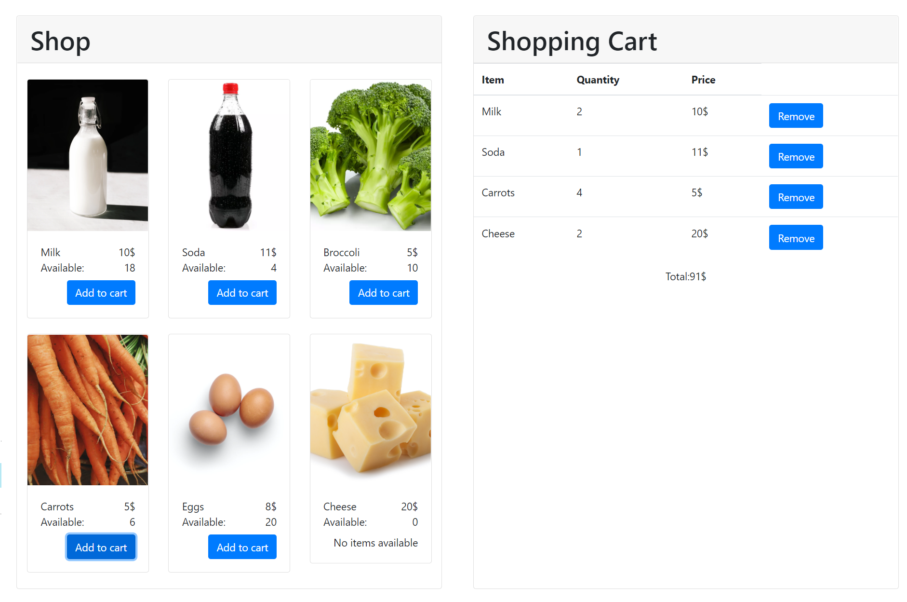

This README will present the subject, the code and how to run it.

## The subject

This is an e-shop with a list of 6 products (with their name, price, image, availability and "Add to cart" button) fetched from the backend and displayed in the frontend, along with a cart in which you can see items added to cart, remove them and see the total price of the cart. 



## The code

This repository contains a *backend* folder and a *frontend* folder that contains a src folder with 2 files `index.html` and `index.tsx` and 2 folders *Cart* and *Shop*. 

`index.html` is the HTML page that will be displayed on your browser when you run the code. But there is not much code in it. Indeed the "interesting" code is in the Javascript files whose root is the file `index.jsx` that imports the components `Cart` and `Shop`. 

Running this code displays a page with the e-shop. 

The style is handled through the Bootstrap library (see [Bootstrap docs](https://getbootstrap.com/docs/5.0/getting-started/introduction/)). So the style is determined by all the `className=...`.


## How to run it

### Backend 

To start the server, open a new terminal, go to `backend` and run the following command: `go run products.go`. You should have downloaded Go, you can get it from [here](https://golang.org/dl/).

### Frontend

In order to run the frontend you need to get Node.js and npm. You can get both by downloading Node.js [here](https://nodejs.org/en/download/) and following the installation instructions. 

Then download this repository (by downloading the .zip and extracting it for example), go to the `frontend` and run 
```
npm install
```
to install all the necessary packages. Finally you can run the code with the command
```
npm start
```
Frontend is now running.
